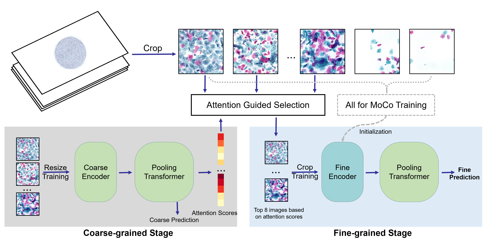
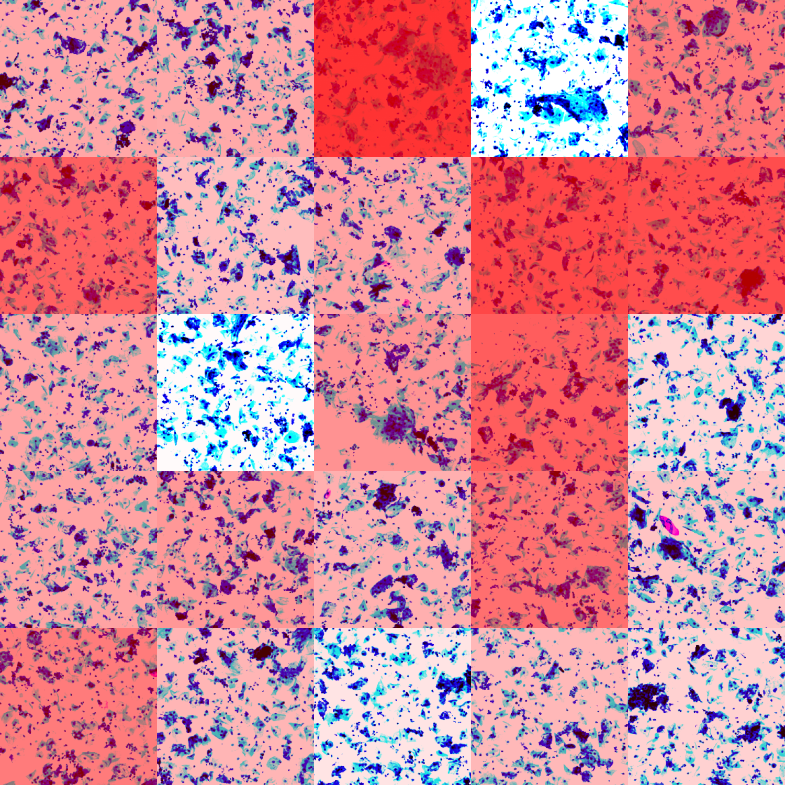
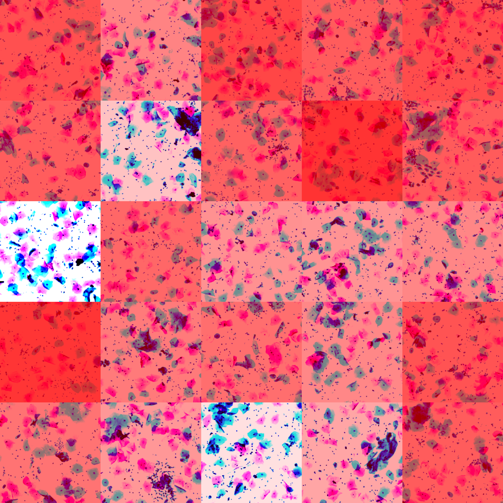

# Detection-free-MICCAI2023
Welcome to the repository for our MICCAI 2023 paper titled "XXX". In this repository, you will find the necessary resources, including code, pre-trained models for our detection-free method.

After submitting our paper, we continued to conduct larger-scale experiments (for 10000-level samples) and achieved even better results. The link to the updated pre-trained model checkpoint can be found below:

[Model Checkpoint for Transformer](链接：https://pan.baidu.com/s/1dIqM4qyJEA4EzZVNjsDFpA 
提取码：mn46)

[Model Checkpoint for ResNet](链接：https://pan.baidu.com/s/12dAiemPcoDe-dWegQ--Rfg 
提取码：wfrf)

We hope that our work can contribute to the field and encourage further research in detection-free methods. Please feel free to explore our repository and use our resources for your own research. If you have any questions or issues or if you would like to have collaboration with our large amount of data, don't hesitate to contact us at qianwang@shanghaitech.edu.cn

Happy researching!
